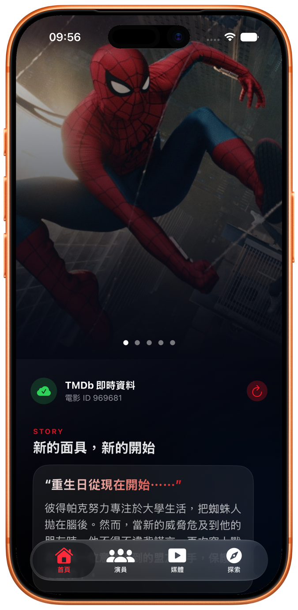
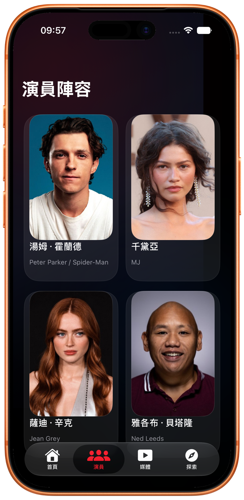
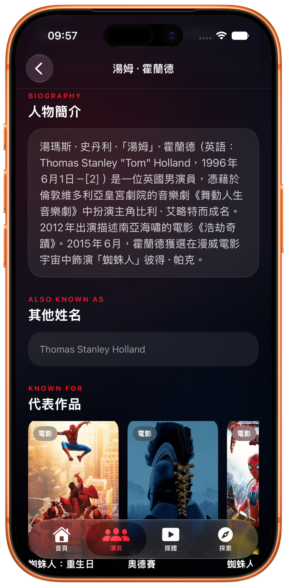
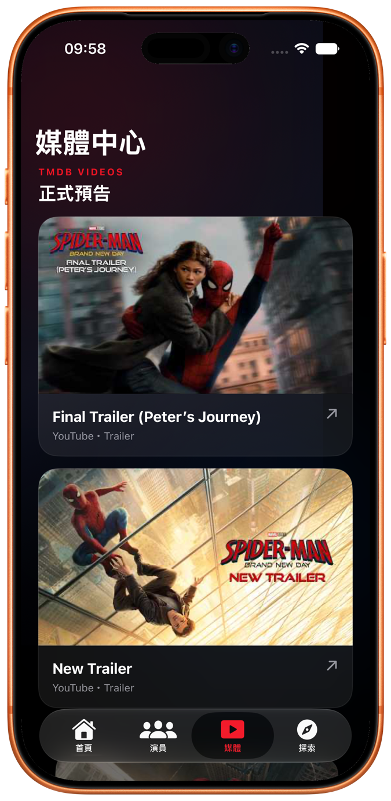
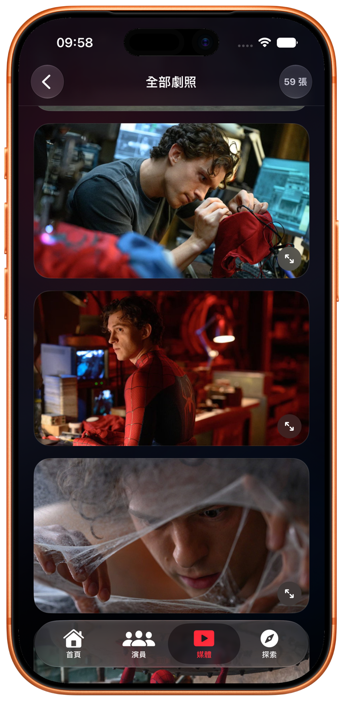

# Spider-Man: Brand New Day

<p align="center">
  A cinematic SwiftUI companion app powered by live movie, cast, image, and video data from TMDb.
</p>

<p align="center">
  <a href="#english">English</a> ·
  <a href="#繁體中文">繁體中文</a>
</p>

---

<a id="english"></a>

## English

### Overview

Spider-Man: Brand New Day is an iOS movie companion app built entirely with
SwiftUI. It presents the movie story, cast, biographies, trailers, backdrops,
related titles, and the official Sony Pictures website in a cinematic
Spider-Man-inspired interface.

The app requests live data from the TMDb API for movie ID `969681`. When no
TMDb token is configured, it remains usable with verified presentation data and
clearly indicates that it is running in demo mode.

### Screenshots

<table>
  <tr>
    <td align="center">
      <br>
      <sub><strong>Home</strong></sub>
    </td>
    <td align="center">
      <br>
      <sub><strong>Cast</strong></sub>
    </td>
    <td align="center">
      <br>
      <sub><strong>Person Details</strong></sub>
    </td>
  </tr>
  <tr>
    <td align="center">
      <br>
      <sub><strong>Trailers</strong></sub>
    </td>
    <td align="center">
      <br>
      <sub><strong>Backdrop Gallery</strong></sub>
    </td>
    <td align="center">
      <strong>Live TMDb content</strong><br><br>
      Movie details, cast profiles, landscape YouTube thumbnails, and the full
      backdrop collection are loaded dynamically.
    </td>
  </tr>
</table>

### Highlights

- Four-tab interface for Home, Cast, Media, and Explore.
- `NavigationStack` and `NavigationLink(destination:label:)` navigation.
- Horizontally paged artwork implemented with a page-style `TabView`.
- Cast and gallery layouts built with `LazyVGrid`.
- `Identifiable` models used in SwiftUI lists and collections.
- Vertical pages containing horizontally scrolling cast and related-title
  sections.
- Detailed cast profiles with localized biography fallback, personal
  information, aliases, and known-for credits.
- TMDb trailer cards featuring large landscape YouTube thumbnails.
- Complete TMDb backdrop gallery with full-screen image viewing.
- In-app browsing for trailers and the official Sony Pictures website through
  `WKWebView`.
- Cinematic transitions, scroll reveals, glass cards, and Spider-Man-inspired
  colors.

### Requirements

- Xcode with the iOS 27 SDK
- iOS 27.0 or later
- A TMDb API Read Access Token for live content

### TMDb Setup

1. Get an **API Read Access Token** from
   [TMDb API Settings](https://www.themoviedb.org/settings/api).
2. Create your local secrets file:

   ```sh
   cp Config/Secrets.example.xcconfig Config/Secrets.xcconfig
   ```

3. Replace `YOUR_TMDB_READ_ACCESS_TOKEN` in
   `Config/Secrets.xcconfig` with your token.
4. Build and run the `Spider Man` scheme.

`Config/Secrets.xcconfig` is excluded by `.gitignore`.
`Config/Shared.xcconfig` optionally imports the local secret and injects it into
the app bundle through the `TMDBReadAccessToken` key in `Config/Info.plist`.

Never place a real token in Swift source code, `project.pbxproj`,
`Secrets.example.xcconfig`, or any other tracked file.

> This approach prevents accidental Git exposure, but a token bundled in a
> client app can still be extracted. High-value secrets should be kept behind a
> server-side API.

### Data Sources

- TMDb movie ID: `969681`
- TMDb API:
  `/movie/969681?append_to_response=credits,images,videos,similar`
- Sony Pictures official movie website

This product uses the TMDB API but is not endorsed or certified by TMDB.

---

<a id="繁體中文"></a>

## 繁體中文

### 專案介紹

《蜘蛛人：重生日》是一款完全使用 SwiftUI 製作的 iOS 電影資訊 App。
以充滿電影感的蜘蛛人主題介面，呈現電影故事、演員陣容、人物簡介、
預告片、完整劇照、相關作品，以及 Sony Pictures 官方網站。

App 會透過 TMDb API 讀取電影 ID `969681` 的即時資料。若尚未設定 TMDb
Token，仍可使用已查核的展示資料啟動，首頁也會清楚標示目前為展示資料模式。

### App 畫面

<table>
  <tr>
    <td align="center">
      <br>
      <sub><strong>電影首頁</strong></sub>
    </td>
    <td align="center">
      <br>
      <sub><strong>演員陣容</strong></sub>
    </td>
    <td align="center">
      <br>
      <sub><strong>人物詳細資料</strong></sub>
    </td>
  </tr>
  <tr>
    <td align="center">
      <br>
      <sub><strong>正式預告</strong></sub>
    </td>
    <td align="center">
      <br>
      <sub><strong>完整劇照</strong></sub>
    </td>
    <td align="center">
      <strong>TMDb 即時內容</strong><br><br>
      電影資料、人物頁面、橫式 YouTube 縮圖與完整 backdrop 劇照皆由 API
      動態載入。
    </td>
  </tr>
</table>

### 主要功能

- 使用四個 Tab 切換首頁、演員、媒體與探索頁面。
- 使用 `NavigationStack` 與 `NavigationLink(destination:label:)` 切換頁面。
- 使用 page-style `TabView` 實現可水平滑動的劇照分頁。
- 使用 `LazyVGrid` 製作演員與劇照的格狀排列。
- SwiftUI List 與集合資料採用遵從 `Identifiable` 的模型。
- 上下捲動頁面中包含可水平捲動的演員與相關作品區塊。
- 詳細人物頁面包含中文簡介備援、人物資訊、其他姓名與代表作品。
- TMDb 正式預告以大型橫式 YouTube 縮圖呈現。
- 可瀏覽完整 TMDb backdrop 劇照，並支援全螢幕檢視。
- 使用 `WKWebView` 在 App 內開啟預告與 Sony Pictures 官方網站。
- 加入電影感轉場、捲動出場動畫、玻璃卡片與蜘蛛人主題配色。

### 系統需求

- 具備 iOS 27 SDK 的 Xcode
- iOS 27.0 或更新版本
- TMDb API Read Access Token，用於載入即時資料

### TMDb 設定

1. 到 [TMDb API Settings](https://www.themoviedb.org/settings/api) 取得
   **API Read Access Token**。
2. 建立本機私密設定檔：

   ```sh
   cp Config/Secrets.example.xcconfig Config/Secrets.xcconfig
   ```

3. 將 `Config/Secrets.xcconfig` 中的
   `YOUR_TMDB_READ_ACCESS_TOKEN` 替換成真實 Token。
4. 建置並執行 `Spider Man` scheme。

`Config/Secrets.xcconfig` 已列入 `.gitignore`。
`Config/Shared.xcconfig` 會選擇性載入本機秘密檔，並透過
`Config/Info.plist` 的 `TMDBReadAccessToken` 鍵將設定注入 App bundle。

請勿將正式 Token 寫入 Swift 原始碼、`project.pbxproj`、
`Secrets.example.xcconfig`，或任何會提交到版本庫的檔案。

> 這個方法可以避免 Token 意外上傳到 Git，但放入用戶端 App 的 Token
> 仍可能被擷取。高價值密鑰應保存在自己的後端 API。

### 資料來源

- TMDb 電影 ID：`969681`
- TMDb API：
  `/movie/969681?append_to_response=credits,images,videos,similar`
- Sony Pictures 官方電影網站

本產品使用 TMDB API，但未經 TMDB 認可或認證。
